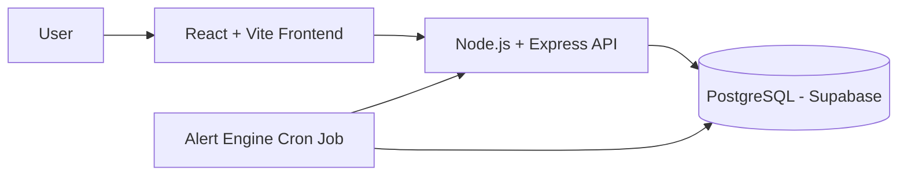
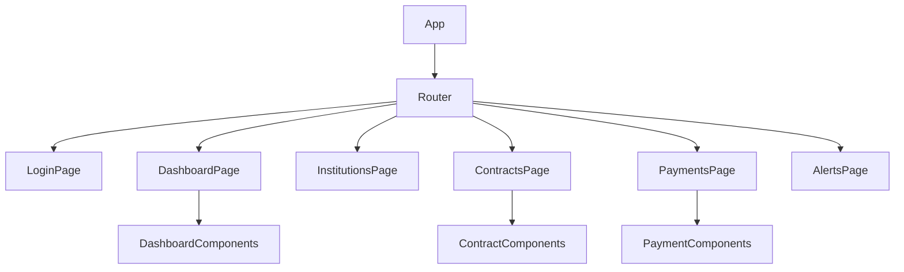
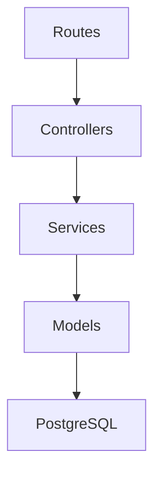
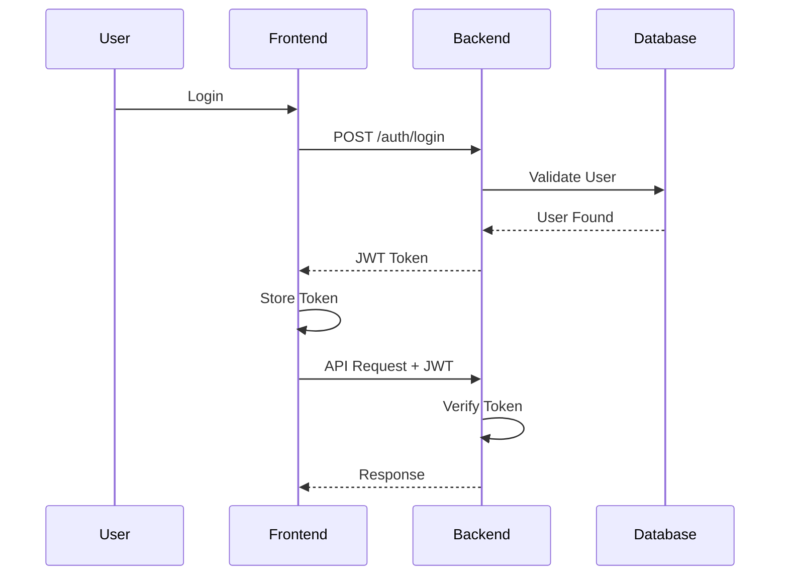
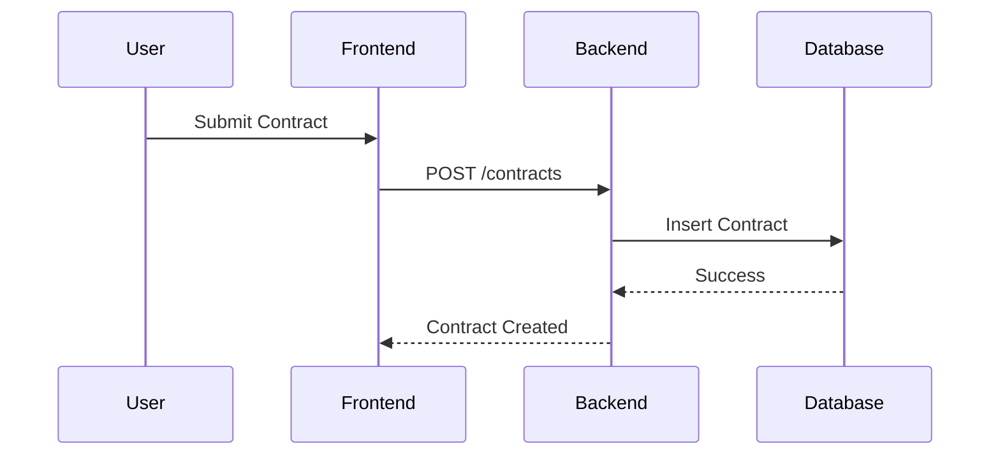
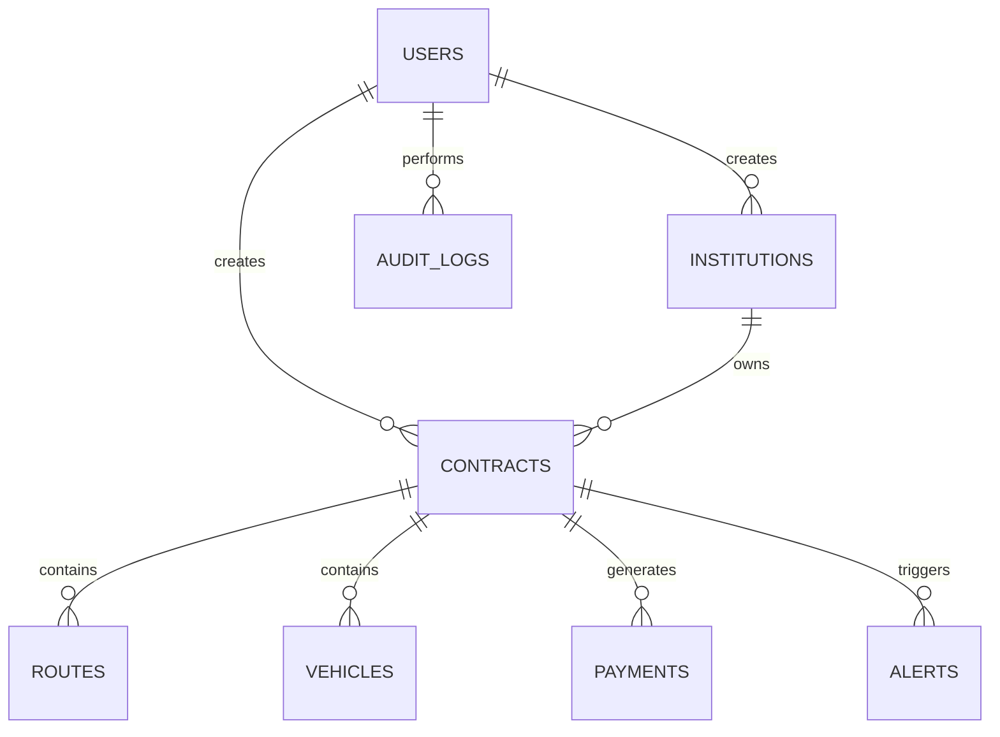
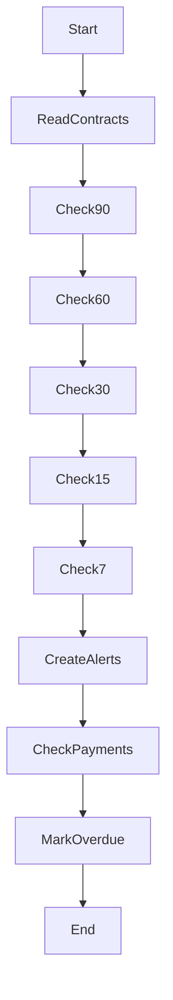
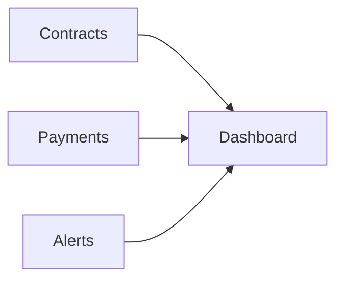
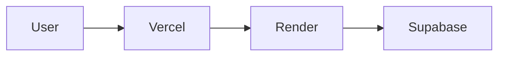

# Architecture

# School & College Transport Contract Management System

## Architecture Document

Version: 1.0  
Project: Internship Project  
Client: Manivtha Tours & Travels

---

# 1. System Overview

The School & College Transport Contract Management System is a web-based application designed to manage institutional transport contracts, contract renewals, routes, vehicles, payments, alerts, and reporting.

The system follows a modern three-tier architecture:

1. Presentation Layer (React Frontend)
2. Application Layer (Node.js/Express Backend)
3. Data Layer (PostgreSQL Database)

---

# 2. High-Level Architecture



---

# 3. Technology Stack

| Layer | Technology |
|---------|---------|
| Frontend | React |
| Build Tool | Vite |
| UI Styling | Tailwind CSS |
| Charts | Recharts |
| HTTP Client | Axios |
| Backend | Node.js |
| API Framework | Express.js |
| Authentication | JWT |
| Password Security | bcrypt |
| Database | PostgreSQL |
| Database Hosting | Supabase |
| Scheduler | node-cron |
| Backend Hosting | Render |
| Frontend Hosting | Vercel |
| Source Control | Git + GitHub |

---

# 4. Architectural Goals

The architecture must:

- Support modular development
- Allow easy maintenance
- Support future scaling
- Support secure authentication
- Support alert scheduling
- Support reporting and analytics

---

# 5. Frontend Architecture

## Overview

Frontend is built using React and follows component-based architecture.



---

# 6. Frontend Folder Structure

```text
frontend/

├── public/

├── src/

│   ├── api/
│   │   ├── axios.js
│   │   ├── authApi.js
│   │   ├── institutionApi.js
│   │   ├── contractApi.js
│   │   ├── paymentApi.js
│   │   ├── alertApi.js
│   │   └── reportApi.js
│
│   ├── components/
│   │   ├── layout/
│   │   ├── dashboard/
│   │   ├── contracts/
│   │   ├── payments/
│   │   └── alerts/
│
│   ├── pages/
│   │   ├── Login.jsx
│   │   ├── Dashboard.jsx
│   │   ├── Institutions.jsx
│   │   ├── Contracts.jsx
│   │   ├── ContractForm.jsx
│   │   ├── Payments.jsx
│   │   └── Alerts.jsx
│
│   ├── context/
│   │   └── AuthContext.jsx
│
│   ├── routes/
│   │   └── ProtectedRoute.jsx
│
│   ├── hooks/
│
│   ├── utils/
│
│   ├── App.jsx
│
│   └── main.jsx
│
└── package.json
```

---

# 7. Backend Architecture

## Overview

The backend follows a layered architecture:



Benefits:

- Separation of concerns
- Easier testing
- Easier maintenance
- Reusable business logic

---

# 8. Backend Folder Structure

```text
backend/

├── src/

│   ├── config/
│   │   └── db.js
│
│   ├── controllers/
│   │   ├── authController.js
│   │   ├── institutionController.js
│   │   ├── contractController.js
│   │   ├── routeController.js
│   │   ├── vehicleController.js
│   │   ├── paymentController.js
│   │   ├── alertController.js
│   │   ├── dashboardController.js
│   │   └── reportController.js
│
│   ├── middleware/
│   │   ├── authMiddleware.js
│   │   └── auditMiddleware.js
│
│   ├── models/
│
│   ├── services/
│   │   ├── alertService.js
│   │   └── reportService.js
│
│   ├── cron/
│   │   └── alertCron.js
│
│   ├── routes/
│
│   ├── utils/
│
│   └── server.js
│
├── tests/
│
└── package.json
```

---

# 9. Authentication Flow



---

# 10. Data Flow

## Create Contract



---

# 11. Database Architecture

## Core Entities



---

# 12. Alert Engine Architecture

## Purpose

The Alert Engine automatically monitors:

- Contract expiry
- Contract renewals
- Overdue payments
- Insurance expiry

---

## Scheduler

Uses:

```text
node-cron
```

Runs:

```text
Every day at 09:00 AM
```

Cron Expression:

```javascript
0 9 * * *
```

---

# 13. Alert Processing Workflow



---

# 14. Dashboard Architecture

Dashboard aggregates:

- Active contracts
- Pending renewals
- Overdue payments
- Upcoming alerts
- Revenue totals



---

# 15. Reporting Architecture

Reports generated from:

- Contracts
- Payments
- Alerts

Supported outputs:

- Table view
- CSV Export
- PDF Export

---

# 16. Audit Logging Architecture

All CRUD actions are recorded.

Tracked Actions:

- CREATE
- UPDATE
- DELETE

Stored In:

```text
audit_logs
```

---

# 17. Deployment Architecture



---

# 18. Deployment Responsibilities

## Vercel

Hosts:

- React Frontend

Environment Variables:

```env
VITE_API_URL=
```

---

## Render

Hosts:

- Express Backend

Environment Variables:

```env
DATABASE_URL=
JWT_SECRET=
```

---

## Supabase

Hosts:

- PostgreSQL Database

Stores:

- Users
- Contracts
- Institutions
- Routes
- Vehicles
- Payments
- Alerts
- Audit Logs

---

# 19. Security Architecture

Security Controls:

- JWT Authentication
- Password Hashing (bcrypt)
- Protected Routes
- Environment Variables
- Database Constraints
- Foreign Keys

---

# 20. Scalability Considerations

Future upgrades can include:

- Email notifications
- SMS alerts
- Mobile application
- Multi-company support
- GPS tracking
- Advanced analytics

---

# 21. MVP Scope

The MVP includes:

- Authentication
- Institutions
- Contracts
- Routes
- Vehicles
- Payments
- Alerts
- Dashboard
- Reports
- Audit Logs

---

# 22. Key Architectural Highlight

The most important component of the system is:

**Expiry Tracking & Alert Trigger Engine**

This module continuously monitors:

- Contract renewals
- Contract expirations
- Overdue payments

and automatically generates alerts before business issues occur.

It is the primary differentiator of the system and the most important feature for internship evaluation.