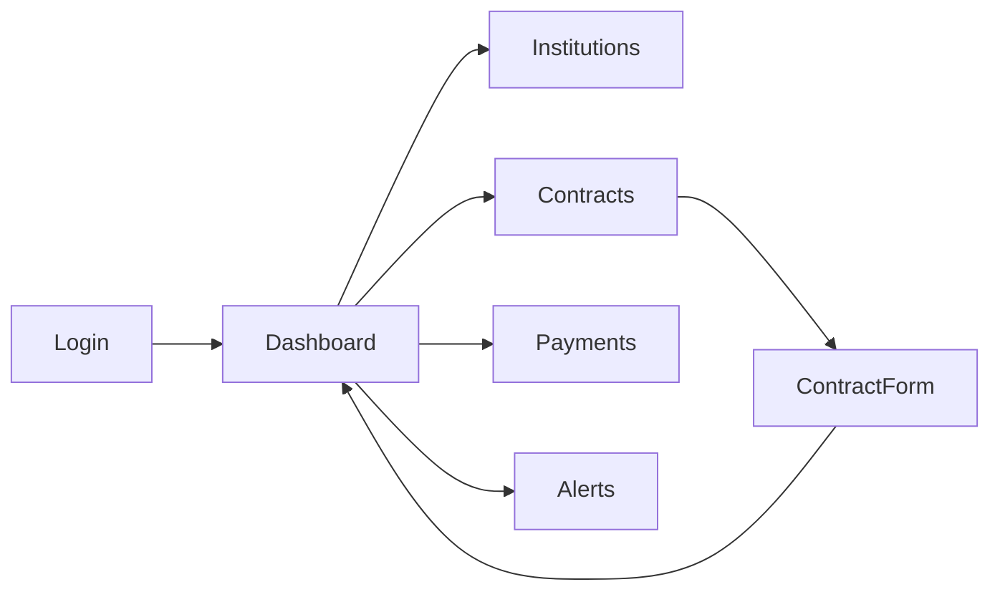

# Wireframes

# School & College Transport Contract Management System

# Wireframes & UI Specifications

Version: 1.0

Client: Manivtha Tours & Travels

---

# Design Principles

The UI should be:

- Simple
- Professional
- Responsive
- Easy to use
- Dashboard-centric
- Optimized for operations staff

---

# Screen 1: Login Screen

## Purpose

Authenticate users into the system.

## API Used

```http
POST /api/auth/login
```

## Wireframe

```text
+--------------------------------------------------+
|                                                  |
|         TRANSPORT CONTRACT MANAGEMENT            |
|                                                  |
|              Welcome Back                        |
|                                                  |
|  Email Address                                  |
|  +------------------------------------------+    |
|  | admin@example.com                        |    |
|  +------------------------------------------+    |
|                                                  |
|  Password                                       |
|  +------------------------------------------+    |
|  | **************                           |    |
|  +------------------------------------------+    |
|                                                  |
|      [ Login ]                                  |
|                                                  |
+--------------------------------------------------+
```

## Components

- Logo
- Email Input
- Password Input
- Login Button
- Error Message Area

---

# Screen 2: Dashboard

## Purpose

Provide operational overview.

## APIs Used

```http
GET /api/dashboard/summary

GET /api/dashboard/revenue-chart

GET /api/alerts/upcoming
```

## Wireframe

```text
+-------------------------------------------------------------+
| Sidebar | Dashboard                                         |
+-------------------------------------------------------------+

+-------------+ +-------------+ +-------------+ +------------+
| Active      | | Renewals    | | Overdue     | | Alerts     |
| Contracts   | | Pending     | | Payments    | | Upcoming   |
+-------------+ +-------------+ +-------------+ +------------+

+-------------------------------------------------------------+
|                                                             |
| Revenue Trend Chart                                         |
|                                                             |
|                  Recharts Line Chart                        |
|                                                             |
+-------------------------------------------------------------+

+-------------------------------------------------------------+
| Upcoming Alerts                                             |
+-------------------------------------------------------------+
| Alert 1                                                     |
| Alert 2                                                     |
| Alert 3                                                     |
+-------------------------------------------------------------+
```

## Components

- Sidebar
- KPI Cards
- Revenue Chart
- Alert List
- Navbar

---

# Screen 3: Contract List + Search

## Purpose

Manage contracts.

## APIs Used

```http
GET /api/contracts

DELETE /api/contracts/:id
```

## Wireframe

```text
+-------------------------------------------------------------+
| Contracts                                                   |
+-------------------------------------------------------------+

 Search:
+---------------------------------------------+
| Search Contract Number                      |
+---------------------------------------------+

 Filters:

[ Active ]
[ Pending Renewal ]
[ Expired ]

+-------------------------------------------------------------+
| Contract No | Institution | End Date | Status | Actions |
+-------------------------------------------------------------+
| CNT001      | ABC School  | 01-Jan   | Active | Edit   |
| CNT002      | XYZ College | 15-Feb   | Active | Delete |
+-------------------------------------------------------------+

Pagination:

< Prev | 1 | 2 | 3 | Next >
```

## Components

- Search Bar
- Status Filters
- Table
- Pagination
- Edit Button
- Delete Button
- Add Contract Button

---

# Screen 4: Contract Form

## Purpose

Create or update contracts.

## APIs Used

```http
POST /api/contracts

PUT /api/contracts/:id

GET /api/institutions
```

## Wireframe

```text
+------------------------------------------------------------+
| Create Contract                                            |
+------------------------------------------------------------+

 Institution

 [ Dropdown ]

 Contract Number

 [ Input ]

 Start Date

 [ Date Picker ]

 End Date

 [ Date Picker ]

 Renewal Date

 [ Date Picker ]

 Billing Cycle

 [ Monthly ▼ ]

 Contract Value

 [ Input ]

 Notes

 [ Textarea ]

 [ Save Contract ]

 [ Cancel ]

+------------------------------------------------------------+
```

## Components

- Institution Dropdown
- Date Pickers
- Billing Cycle Dropdown
- Text Inputs
- Notes Textarea
- Save Button

---

# Screen 5: Payment Tracker

## Purpose

Track invoices and payment status.

## APIs Used

```http
GET /api/payments

PATCH /api/payments/:id/status
```

## Wireframe

```text
+-------------------------------------------------------------+
| Payment Tracker                                             |
+-------------------------------------------------------------+

 Search Invoice

+-------------------------------------+
| INV-1001                            |
+-------------------------------------+

+-------------------------------------------------------------+
| Invoice | Amount | Due Date | Status | Action |
+-------------------------------------------------------------+
| INV001  | 25000  | 10-Jan   | Unpaid | Mark Paid |
| INV002  | 50000  | 20-Jan   | Paid   | View      |
+-------------------------------------------------------------+
```

## Components

- Search Box
- Payments Table
- Status Badge
- Mark Paid Button

## Status Colors

```text
PAID       → Green
UNPAID     → Yellow
OVERDUE    → Red
```

---

# Screen 6: Alerts Panel

## Purpose

Manage and monitor alerts.

## APIs Used

```http
GET /api/alerts

GET /api/alerts/upcoming

POST /api/alerts/manual

PATCH /api/alerts/:id/sent
```

## Wireframe

```text
+-------------------------------------------------------------+
| Alerts                                                      |
+-------------------------------------------------------------+

[ Create Manual Alert ]

+-------------------------------------------------------------+
| Alert Type | Alert Date | Status | Action |
+-------------------------------------------------------------+
| Renewal    | 15-Jan     | New    | Mark Sent |
| Expiry     | 20-Jan     | Sent   | View      |
+-------------------------------------------------------------+
```

## Components

- Alert Table
- Create Alert Button
- Status Badge
- Mark Sent Button

---

# Shared Layout

## Sidebar

```text
+------------------+
| Dashboard        |
| Institutions     |
| Contracts        |
| Routes           |
| Vehicles         |
| Payments         |
| Alerts           |
| Reports          |
| Audit Logs       |
| Logout           |
+------------------+
```

## Navbar

```text
+-------------------------------------------------------------+
| Search | Notifications | User Profile |
+-------------------------------------------------------------+
```

---

# Responsive Behavior

## Desktop (>1024px)

```text
Sidebar Visible
Charts Side-by-Side
Tables Full Width
```

## Tablet (768px–1024px)

```text
Collapsible Sidebar
Stacked Charts
```

## Mobile (<768px)

```text
Hamburger Menu
Single Column Layout
Scrollable Tables
```

---

# User Flow



---

# Dashboard Data Sources

| Widget | API |
|----------|----------|
| Active Contracts | GET /dashboard/summary |
| Pending Renewals | GET /dashboard/summary |
| Overdue Payments | GET /dashboard/summary |
| Revenue Chart | GET /dashboard/revenue-chart |
| Upcoming Alerts | GET /alerts/upcoming |

---

# MVP Screen List

The MVP includes:

1. Login
2. Dashboard
3. Institutions
4. Contract List
5. Contract Form
6. Payments
7. Alerts

These screens are sufficient to demonstrate the complete contract management workflow and the core Expiry Tracking & Alert Engine during internship review.